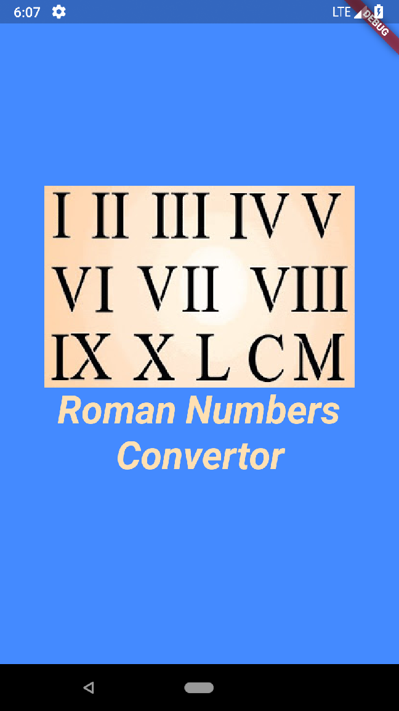

# Roman Numbers
Simple [Flutter](https://flutter.io/) project about converting and learning Roman numbers

## Getting Started
The project should consists of two parts:

[v] convertor where you can convert roman numbers to decimal numbers and decimal numbers to roman numbers;

[ ] quiz with three different levels for learning roman numbers , whe should use dart:math Random and the convertor from the previous step

###Screenshots

1. Flash 
 (It is basic Flash activity to start the application)

